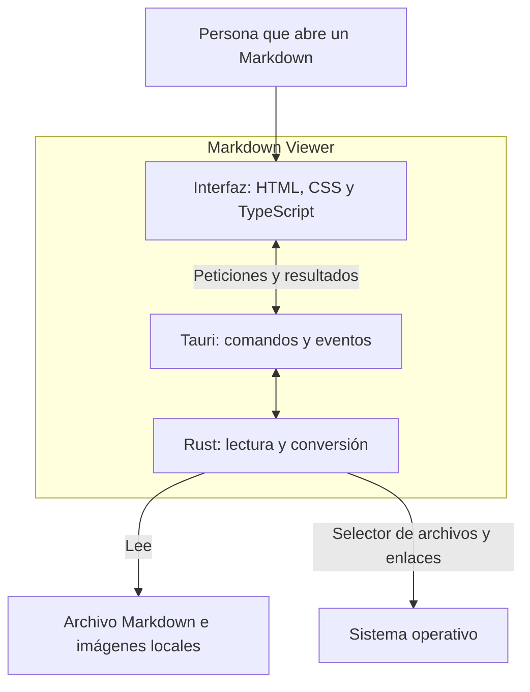
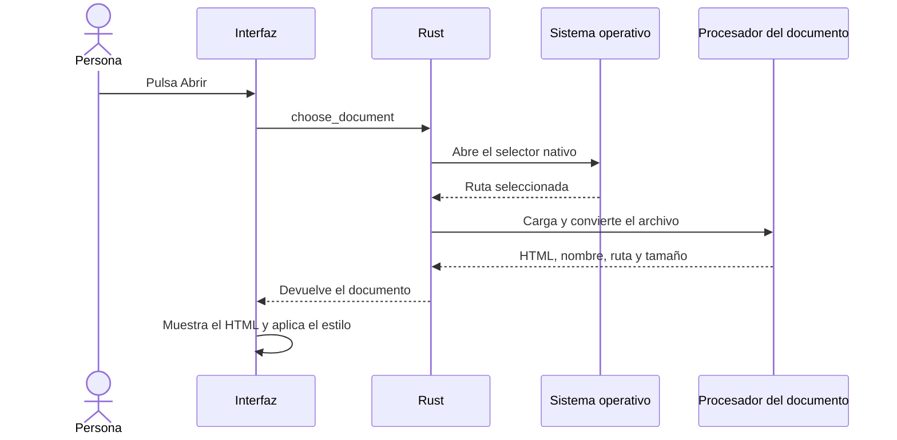
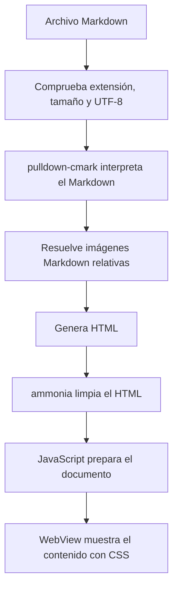

# Arquitectura de Markdown Viewer

Markdown Viewer abre un archivo Markdown y lo muestra en una ventana de solo lectura. El objetivo es que puedas empezar a leer con poca espera, sin abrir un editor.

Este documento describe el prototipo actual. Los diagramas usan Mermaid. GitHub puede mostrarlos como diagramas; por ahora, nuestra app los muestra como bloques de código. Cada diagrama tiene una explicación que permite entenderlo también sin renderizarlo.

Para profundizar en cada pieza, continúa con [La interfaz](interfaz.md), [La coordinación en Rust](coordinacion-rust.md) y [El procesamiento del documento](procesamiento-documento.md).

## 1. Las piezas de la app

La app tiene una interfaz hecha con HTML, CSS y TypeScript, y una parte escrita en Rust que lee y procesa archivos. Tauri conecta ambas partes y crea la ventana de escritorio.

La interfaz pide abrir un archivo. Rust lo lee y devuelve HTML listo para mostrar. Tauri permite hacer esa petición desde JavaScript y recibir el resultado.

| Pieza | Qué hace | Dónde está |
| --- | --- | --- |
| Interfaz | Muestra el documento, los botones y los errores. | [`src/index.html`](../src/index.html), [`src/app.ts`](../src/app.ts) y [`src/style.css`](../src/style.css) |
| Coordinación en Rust | Recibe las peticiones, abre el selector nativo y gestiona aperturas del sistema. | [`src-tauri/src/main.rs`](../src-tauri/src/main.rs) |
| Procesamiento del documento | Valida el archivo, convierte Markdown a HTML y limpia el resultado. | [`src-tauri/src/document.rs`](../src-tauri/src/document.rs) |
| Configuración de Tauri | Define la ventana, las reglas de contenido y los paquetes de instalación. | [`src-tauri/tauri.conf.json`](../src-tauri/tauri.conf.json) |
| Permisos de eventos | Permite que la interfaz escuche eventos de la ventana principal. | [`src-tauri/capabilities/main.json`](../src-tauri/capabilities/main.json) |

La interfaz vive dentro de un WebView, una vista que muestra HTML usando el motor web disponible en el sistema. La app no necesita un servidor remoto para leer documentos.

## 2. Qué ocurre cuando abres un archivo

Puedes usar el botón de abrir, `Ctrl+O` o `⌘O`, arrastrar un archivo, o abrirlo desde el sistema operativo. Todas esas entradas terminan usando la misma función de carga en Rust.

Este es el recorrido cuando utilizas el botón:

Rust realiza la lectura y conversión en una tarea de trabajo separada mediante `spawn_blocking`, para que ese trabajo no ocupe la tarea que atiende la petición.

La interfaz recibe cuatro datos: `html`, `name`, `path` y `bytes`. Inserta el HTML, muestra el nombre y tamaño del archivo y vuelve al inicio del documento. Después prepara los enlaces internos, las casillas de tareas y las imágenes.

Si cancelas el selector, el documento actual sigue abierto. Si falla la carga, aparece un error y puedes seguir leyendo el documento anterior. Si haces varias peticiones seguidas, la interfaz usa un contador para descartar resultados anteriores que lleguen tarde.

## 3. Cómo se convierte Markdown en algo visible

Hay dos trabajos distintos: interpretar el Markdown y mostrar el HTML resultante. El primero ocurre en Rust; el segundo, en el WebView.

`pulldown-cmark` reconoce la estructura del documento, como encabezados, párrafos, listas y bloques de código. También activamos tablas, tareas, texto tachado y notas al pie.

Durante ese procesamiento, Rust resuelve las imágenes Markdown locales y las incluye en el HTML como datos Base64. Así, el WebView puede mostrarlas sin recibir acceso general al sistema de archivos. Las imágenes remotas con HTTPS conservan su dirección y el WebView las descarga.

`ammonia` elimina elementos y atributos peligrosos, como scripts y manejadores de eventos. El visor muestra el HTML permitido con nuestro CSS, que sigue el tema claro u oscuro del sistema.

Los bloques de código se muestran con letra monoespaciada. Actualmente no hay resaltado de sintaxis, renderizado de Mermaid ni fórmulas matemáticas. Tampoco hemos verificado el visor contra toda la suite de CommonMark.

## 4. Cómo llega un archivo desde el sistema operativo

Tauri configura asociaciones para `.md`, `.markdown`, `.mdown` y `.mkd`. Al instalar la app, puedes elegirla mediante "Abrir con". El sistema operativo decide qué aplicación queda como predeterminada.

Al iniciar, Rust guarda la ruta recibida como archivo pendiente. La interfaz primero empieza a escuchar eventos y después pide ese archivo con `take_pending_document`. Ese orden permite atender aperturas que lleguen mientras arranca la ventana.

Si ya hay una instancia abierta, el plugin `single-instance` envía la nueva ruta a esa instancia y enfoca su ventana. En macOS también atendemos los eventos de apertura de archivos del sistema. El estado pendiente guarda una sola ruta, porque el visor muestra un documento a la vez.

Al cerrar la ventana, termina la aplicación. No hay un proceso residente esperando futuras aperturas.

## 5. Qué puede leer o ejecutar un documento

El contenido del archivo pasa por estas reglas antes de mostrarse:

| Recurso | Regla actual |
| --- | --- |
| Markdown | Archivo UTF-8 de hasta 16 MiB, con una extensión admitida. |
| Imágenes Markdown locales | Deben estar en la carpeta del documento o en sus subcarpetas. Se comprueba la ruta real, incluidos enlaces simbólicos. |
| Tamaño de imágenes locales | Hasta 8 MiB por imagen y 32 MiB en total por documento. |
| Imágenes remotas | Solo HTTPS. Requieren conexión de red. |
| HTML incrustado | `ammonia` filtra las etiquetas, atributos y direcciones permitidas. |
| Enlaces dentro del documento | Los enlaces `#seccion` desplazan la vista al destino. |
| Enlaces externos | Rust solo permite abrir `http`, `https` y `mailto` con la aplicación del sistema. |
| Enlaces a otros archivos locales | Todavía no se abren. |

La política de contenido de Tauri, llamada CSP, limita qué puede cargar o ejecutar el WebView. Los scripts y estilos deben venir de la app; el documento no puede añadir scripts propios, marcos ni formularios funcionales.

Las imágenes relativas escritas como HTML crudo no siguen el tratamiento de las imágenes Markdown y se eliminan sus rutas relativas durante la limpieza.

## 6. Qué decisiones ayudan a abrir rápido

La interfaz usa archivos estáticos sin frameworks ni dependencias de ejecución en JavaScript. Rust convierte el documento dentro de la app y Tauri utiliza el WebView del sistema.

El texto no espera a que se descarguen imágenes remotas. Las imágenes usan carga diferida con `loading="lazy"`. Las imágenes locales sí se leen durante la conversión, por lo que un documento con muchas imágenes puede tardar más.

[`scripts/benchmark.mjs`](../scripts/benchmark.mjs) mide la apertura del ejecutable optimizado. El tiempo empieza al entrar en `main` y termina después de dos llamadas a `requestAnimationFrame` tras insertar el documento. Esto aproxima el momento en que el texto puede verse; no mide el pintado físico de la pantalla ni la carga completa de imágenes.

Para comparar resultados entre Windows, Linux y macOS hay que medir en equipos reales con el mismo documento. El [README](../README.md#medición-de-apertura) explica cómo ejecutar esa medición.

## 7. Dónde añadir futuras funciones de visualización

Estas ampliaciones todavía no están implementadas:

| Función | Cómo encajaría |
| --- | --- |
| Mermaid | Detectar sus bloques de código y cargar una biblioteca local para convertirlos en diagramas. |
| Fórmulas | Reconocer la sintaxis matemática y añadir un renderizador de fórmulas. |
| Resaltado de código | Detectar el lenguaje de los bloques y aplicar el resaltado. |

La propuesta es mostrar primero el texto y cargar cada renderizador solo cuando el documento lo necesite. Las bibliotecas se incluirían en la app para funcionar sin internet. Habría que medir su efecto en la apertura y revisar cómo interactúan con la limpieza de HTML y la CSP.

## 8. Cómo comprobamos que funciona

Las pruebas Rust cubren la conversión, la limpieza de HTML, las rutas, los límites de tamaño y las imágenes. [`scripts/smoke.py`](../scripts/smoke.py) prueba el visor real en Linux, incluido el selector nativo, una segunda apertura y el manejo de errores.

GitHub Actions compila los paquetes para los tres sistemas y ejecuta las comprobaciones configuradas en [el workflow](../.github/workflows/build.yml). Las pruebas de interfaz actuales se ejecutan en Linux.

Para ejecutar las comprobaciones locales, consulta [Validación](../README.md#validación) en el README. Esta carpeta `docs/` puede alojar después documentos sobre formatos admitidos, decisiones de diseño y distribución.
