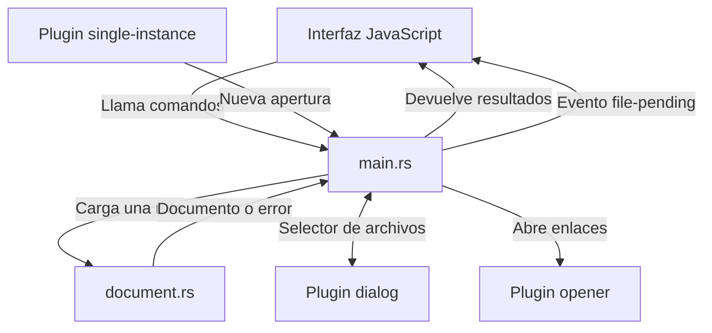
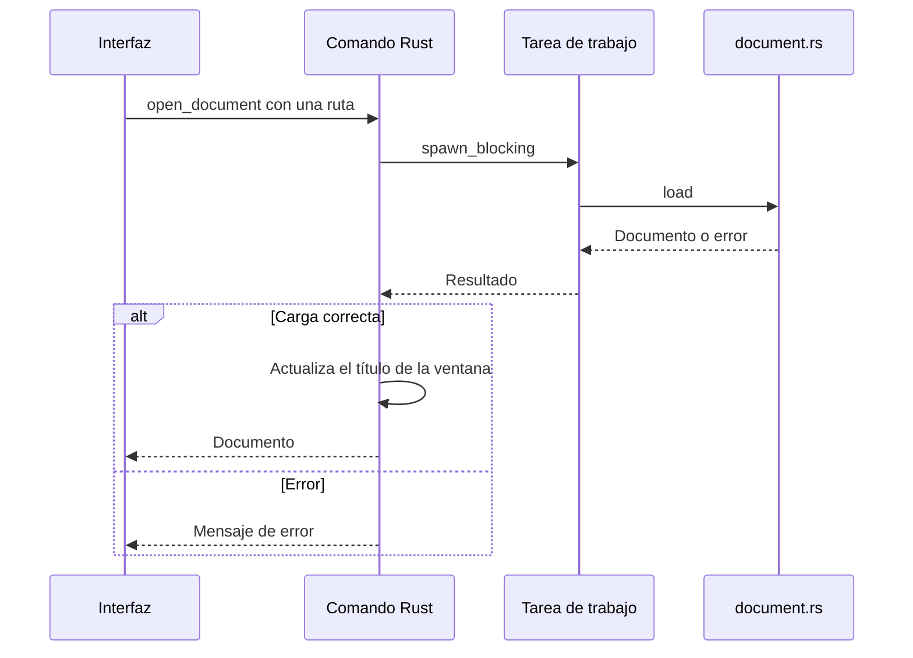

# La coordinación en Rust

Esta pieza conecta la interfaz con el sistema operativo y con el procesador de documentos. Recibe peticiones para abrir archivos, usa el selector nativo y entrega los resultados a JavaScript.

Es la segunda pieza de [la arquitectura](arquitectura.md) y está en [`src-tauri/src/main.rs`](../src-tauri/src/main.rs). Los diagramas describen el prototipo actual y usan Mermaid. GitHub y el visor los renderizan.

## 1. Qué coordina

`main.rs` reúne Tauri, los plugins y los comandos. La lectura y conversión del contenido están en otro módulo, `document.rs`.

Los plugins aportan integración con el escritorio. `dialog` abre el selector de archivos, `opener` usa la aplicación predeterminada para una dirección y `single-instance` entrega nuevas aperturas a la ventana existente.

## 2. Cómo arranca la aplicación

Al entrar en `main`, Rust guarda el momento de inicio y busca una ruta entre los argumentos del proceso. Después configura los plugins, registra el estado compartido y publica los comandos que JavaScript puede llamar.

La configuración en [`tauri.conf.json`](../src-tauri/tauri.conf.json) define la ventana `main` y señala `dist/` como carpeta de la interfaz compilada. Los hooks preparan los archivos generados antes del build y recompilan durante el desarrollo. `withGlobalTauri` habilita las funciones que JavaScript usa desde `window.__TAURI__`.

El estado `Viewer` tiene estos datos:

| Campo | Para qué sirve |
| --- | --- |
| `pending` | Guarda una ruta pendiente de abrir, o ninguna. |
| `started` | Guarda el instante de inicio para medir la apertura. |
| `measured` | Indica si ya se registró la primera medición con documento. |

`pending` está protegido por un `Mutex`, que permite modificarlo desde distintos manejadores sin acceder a la vez. `measured` usa un valor atómico, que puede consultarse y cambiarse de forma segura en una sola operación.

Este estado no guarda el HTML del documento abierto. Ese contenido queda en la [interfaz](interfaz.md). Tampoco guarda un historial en disco.

## 3. Los comandos disponibles

JavaScript llama a estas funciones mediante `invoke`. Tauri transporta los argumentos y convierte los resultados de Rust en datos que JavaScript puede recibir.

| Comando | Entrada | Resultado |
| --- | --- | --- |
| `open_document` | Una ruta. | Un documento o un error. |
| `choose_document` | Sin argumentos propios. | Un documento, ningún documento si se cancela, o un error. |
| `take_pending_document` | Sin argumentos propios. | Carga la ruta pendiente; si no hay ruta, devuelve ningún documento. |
| `open_link` | Una dirección `href`. | Confirma que pudo pedir al sistema abrirla, o devuelve un error. |
| `content_painted` | Si se mostró un documento. | Milisegundos desde el inicio y, en modo de medición, acciones adicionales. |

En Rust, `Result` representa éxito o error. `Option` representa que hay un valor o que no lo hay. Por eso cancelar el selector puede devolver `Ok(None)`: la operación terminó bien, pero no hay archivo seleccionado.

## 4. Cómo carga sin ocupar la tarea que atiende comandos

`load_document` es la función común de carga. Recibe una ruta y ejecuta `document::load` mediante `spawn_blocking`.

La lectura de disco y la conversión pueden ocupar tiempo. `spawn_blocking` las manda a una tarea de trabajo mientras el comando espera el resultado de forma asíncrona. Esto no hace instantánea la conversión, pero evita ejecutarla directamente en la tarea que atiende la petición.

El selector usa el mismo mecanismo para `blocking_pick_file`. El diálogo tiene el título "Abrir Markdown", filtra las extensiones admitidas y se vincula a la ventana principal. Si se selecciona una ruta, sigue el recorrido común de carga.

Un fallo de lectura llega a JavaScript como error. Un fallo de la tarea devuelve un mensaje más general. Si la carga funciona, Rust también cambia el título nativo a `nombre.md · Markdown Viewer`.

## 5. Cómo abre rutas del sistema operativo

`path_from_args` omite el nombre del ejecutable y toma el primer argumento que no comienza por `-`. Reconoce direcciones `file://` y también rutas de archivos.

En una segunda apertura, una ruta relativa se resuelve usando el directorio de trabajo de ese segundo lanzamiento. Por ejemplo, si desde `/proyectos/notas` se abre `lectura.md`, la instancia existente recibe la ruta `/proyectos/notas/lectura.md`.

La primera apertura guarda esa ruta en `pending`. Después, JavaScript registra sus escuchadores y llama a `take_pending_document` para cargarla.

Cuando ya hay una instancia abierta, `single-instance` llama a `queue_file`. Esa función sustituye la ruta pendiente, emite el evento `file-pending`, restaura la ventana si está minimizada y le da el foco.

El evento es un aviso sin la ruta. La interfaz responde llamando a `take_pending_document`. Ese comando retira la ruta del estado con `take()` y libera el bloqueo antes de empezar la lectura.

En macOS, el manejador de `RunEvent::Opened` convierte las direcciones recibidas en rutas y usa `queue_file`. Las asociaciones de extensiones se declaran en la configuración; en Linux, la [plantilla de escritorio](../assets/markdown-viewer.desktop) incluye `%f` para recibir un archivo.

## 6. Qué límites tiene la coordinación actual

Hay una sola ruta pendiente, sin una cola de documentos. Una ruta nueva puede reemplazar a otra que todavía no se haya recogido. Este diseño corresponde a una ventana que muestra un archivo a la vez.

La interfaz descarta respuestas antiguas mediante `requestId`, pero Rust no cancela las cargas anteriores. Además, el título nativo se actualiza al terminar cada carga, antes de que JavaScript compruebe ese contador. Con aperturas simultáneas, el título podría terminar indicando un archivo distinto al contenido visible.

Una segunda apertura sin archivo solo enfoca la ventana. Al cerrarla termina la aplicación; no mantenemos un proceso residente.

## 7. Enlaces, permisos y medición

`open_link` interpreta la dirección y comprueba su esquema. Solo permite `http`, `https` y `mailto` antes de delegar en `opener`. Esa comprobación en Rust se mantiene aunque la interfaz también filtre los enlaces.

Los comandos propios se registran en `invoke_handler`. El [archivo de capacidades](../src-tauri/capabilities/main.json) permite escuchar y dejar de escuchar eventos en la ventana principal. La lectura de documentos y la apertura de enlaces se implementan mediante nuestros comandos; cada uno debe aplicar sus propias validaciones.

`content_painted` calcula los milisegundos desde `started`. La primera llamada con un documento marca `measured`. Si está definida `MD_VIEWER_BENCHMARK`, escribe el tiempo en el registro; si está definida `MD_VIEWER_BENCHMARK_EXIT`, cierra la app después de esa medición. Esos comportamientos permiten automatizar el benchmark.

## 8. Cómo comprobar o ampliar esta pieza

Las pruebas en `main.rs` comprueban rutas relativas y direcciones de archivo con espacios y Unicode. La [prueba de interfaz en Linux](../scripts/smoke.py) comprueba también la segunda apertura, el selector y la restricción de enlaces. Los comandos para validarlo están en el [README](../README.md#validación).

Para añadir otra entrada de apertura, haz que llegue a `load_document` o al estado pendiente. Para cambiar cómo se interpreta el contenido, consulta [Procesamiento del documento](procesamiento-documento.md). Para modificar cuándo se muestra el resultado, consulta [La interfaz](interfaz.md).
