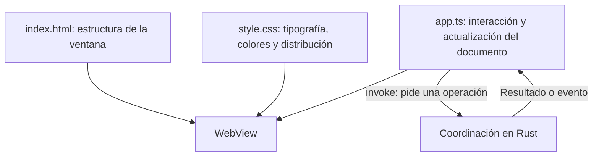
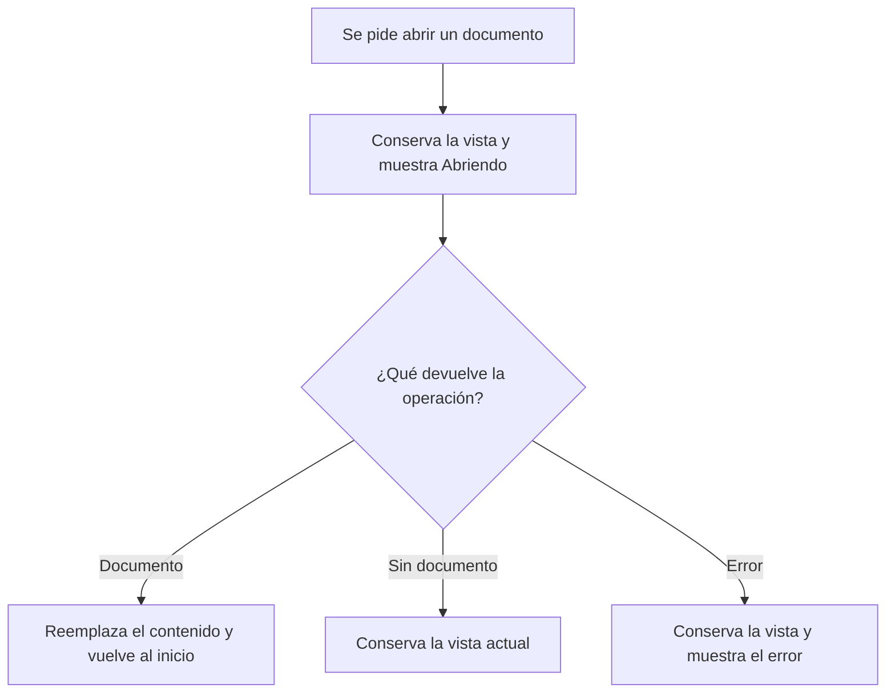

# La interfaz del viewer

La interfaz es la parte que ves al abrir Markdown Viewer. Muestra el documento y convierte acciones como pulsar un botón o arrastrar un archivo en peticiones a Rust.

Este documento profundiza en la primera pieza de [la arquitectura](arquitectura.md). Describe el prototipo actual. Los diagramas usan Mermaid y se renderizan en GitHub y en el visor.

## 1. Los archivos que forman la interfaz

La interfaz usa HTML, CSS y TypeScript sin un framework. TypeScript se compila a JavaScript antes de iniciar o empaquetar la app. Tauri carga el JavaScript generado y las copias de HTML y CSS desde `dist/` dentro del WebView de la ventana principal.



HTML define los elementos, CSS decide cómo se ven y JavaScript actualiza su contenido. JavaScript obtiene el HTML del documento a través de Tauri; la [pieza de procesamiento](procesamiento-documento.md) ya lo ha convertido y limpiado en Rust.

| Archivo | Qué contiene |
| --- | --- |
| [`src/index.html`](../src/index.html) | Barra superior, botones, zona de lectura, pantalla vacía, mensaje de error y aviso para arrastrar archivos. |
| [`src/style.css`](../src/style.css) | Estilo del documento, temas claro y oscuro y ajustes para ventanas estrechas. |
| [`src/app.ts`](../src/app.ts) | Apertura de documentos, eventos, navegación y preparación del HTML. |
| [`src/tauri.d.ts`](../src/tauri.d.ts) | Tipos del documento, comandos y eventos que conectan con Rust. |
| [`scripts/frontend.mjs`](../scripts/frontend.mjs) | Compilación y copia de archivos a `dist/`, con seguimiento de cambios durante el desarrollo. |
| [`src/mermaid.ts`](../src/mermaid.ts) | Detección, código original, límites, cola y generaciones de documento/tema. |
| [`src/mermaid-runtime.ts`](../src/mermaid-runtime.ts) | Biblioteca local de Mermaid, configuración estricta y contenedor temporal. |
| [`src/diagram-svg.ts`](../src/diagram-svg.ts) | Limpieza del SVG, CSS y referencias internas; autorización de estilos mediante nonce. |

## 2. Qué aparece en la ventana

El elemento `#reader` es la zona que se desplaza cuando lees. Dentro están `#empty`, con la invitación a abrir un archivo, y `#document`, donde aparece el contenido.

Al iniciar sin archivo, `#empty` está visible y `#document` oculto. Al cargar un documento válido, JavaScript intercambia su visibilidad. La barra superior muestra el nombre, el tamaño y la ruta completa como texto emergente al situar el cursor sobre el nombre.

El atributo HTML `hidden` controla qué elementos aparecen. La regla CSS `[hidden]` hace que los elementos ocultos no ocupen espacio, incluso si otra regla les asigna una distribución como `flex`.

| Elemento | Función |
| --- | --- |
| `#open` y `#empty-open` | Abren el mismo selector nativo. |
| `#status` | Indica si se está abriendo un archivo o si el documento está en modo de lectura. |
| `#error` | Muestra el error; `Escape` lo oculta. Usa `role="alert"` para anunciarlo a tecnologías de asistencia. |
| `#drop-zone` | Aparece mientras arrastras un archivo sobre la ventana. |

## 3. Cómo pide un documento a Rust

`invoke` es una función de Tauri que llama a un comando Rust y devuelve una promesa. Una promesa permite esperar el resultado sin detener el resto del código de la interfaz.

Por ejemplo, para abrir una ruta obtenida al arrastrar un archivo:

```js
invoke('open_document', { path: '/ruta/lectura.md' })
```

Esa ruta es solo un ejemplo. La app usa la ruta que entrega Tauri y admite los formatos de cada sistema operativo.

| Entrada | Petición que hace la interfaz |
| --- | --- |
| Botón o `Ctrl+O` / `⌘O` | `choose_document`, que abre el selector del sistema y carga la selección. |
| Archivo arrastrado | `open_document`, con la primera ruta recibida en el evento. |
| Aviso `file-pending` | `take_pending_document`, que recoge una apertura recibida desde el sistema. |
| Inicio de la interfaz | `take_pending_document`, después de registrar los escuchadores de eventos. |

`openDocument` reúne el comportamiento común. Oculta un error anterior, muestra "Abriendo…" y espera la operación. Si llega un documento válido, inserta su HTML, lo prepara, actualiza los datos del archivo y desplaza la lectura al principio.

Si el resultado es `null`, la persona canceló el selector o no había archivo pendiente. La interfaz conserva lo que ya estaba mostrando.

## 4. Qué ocurre con errores y aperturas simultáneas

Durante una carga, el contenido anterior permanece visible. La interfaz solo lo reemplaza después de recibir un nuevo documento válido.



Cada llamada a `openDocument` aumenta `requestId`. Cuando llega una respuesta, la interfaz comprueba si pertenece a la petición más reciente.

Por ejemplo, abres A y después B. Si B termina antes y A llega tarde, la interfaz descarta A y sigue mostrando B. La lectura de A no se cancela en Rust; JavaScript descarta su resultado. También descarta los errores de peticiones anteriores.

La lectura inicial del archivo pendiente tampoco puede reemplazar una apertura posterior ni mostrar un error obsoleto sobre ella. La respuesta de `content_painted` se aplica solo si su documento sigue correspondiendo a la petición más reciente.

`choosing` evita abrir varios selectores nativos a la vez. Mientras el selector está activo, ambos botones de apertura quedan desactivados. Al terminar, incluso si hay un error, un bloque `finally` vuelve a activarlos.

## 5. Qué prepara antes de mostrar el HTML

`prepareDocument` ajusta el HTML que recibió de Rust:

| Elemento | Ajuste |
| --- | --- |
| Encabezados sin identificador | Genera un `id` a partir del texto para permitir enlaces internos. |
| Casillas de tareas | Fuerza el tipo `checkbox` y las desactiva para mantener la lectura. |
| Imágenes | Activa carga diferida y decodificación asíncrona; revisa el origen permitido. |

Un encabezado `## Cómo abrir` obtiene el identificador `cómo-abrir`. Otro encabezado igual obtiene `cómo-abrir-1`. Los identificadores existentes se conservan, aunque el contador de duplicados solo incluye los que genera esta función.

Las imágenes deben usar HTTPS o una dirección Base64 de un formato admitido. Si no cumplen esa regla, JavaScript elimina su atributo `src`.

El HTML se inserta con `innerHTML` porque tiene etiquetas que el WebView debe interpretar. El nombre del archivo y los errores usan `textContent`, que los muestra como texto. La limpieza previa en Rust es parte necesaria del recorrido del HTML.

Después, `MermaidController.prepare` encuentra `pre > code.language-mermaid` y conserva su `textContent` en una figura con un desplegable "Ver código". Devuelve una función que activa el renderizado tras la oportunidad de primer pintado. `openDocument` no espera los diagramas para terminar la apertura.

Mermaid se carga en un módulo local diferido. Cada SVG se limpia antes de insertarlo mediante `replaceChildren`. Un error muestra un aviso dentro de su figura y deja el código abierto. Una cola evita renderizados simultáneos y comprueba la generación del documento y del tema antes y después de cada espera. Consulta [Mermaid](mermaid.md) para los límites y la política de estilos.

## 6. Cómo funcionan los enlaces y el diseño

La interfaz escucha los clics en el artículo, incluidos los clics con el botón central. Impide la navegación automática del WebView y decide qué hacer con el destino.

Un enlace `#seccion` desplaza la lectura hacia el elemento con ese identificador. Un enlace web o de correo llama a `open_link`; Rust valida la dirección y la abre con el sistema. Los demás destinos no se abren.

CSS usa fuentes del sistema, un ancho máximo de lectura de 780 píxeles y desplazamiento horizontal dentro de tablas o bloques de código grandes. Las imágenes se ajustan al ancho disponible. El tema oscuro depende de `prefers-color-scheme`, por lo que sigue la preferencia del sistema sin un control propio.

Los diagramas anchos también tienen desplazamiento horizontal. Al cambiar el tema del sistema, el controlador genera nuevos SVG a partir del código original. Mantiene el estado del desplegable y el foco de quien está leyendo el código.

## 7. Cómo participa en la medición de apertura

Después de insertar el documento, JavaScript espera dos llamadas a `requestAnimationFrame` y avisa a Rust con `content_painted`. Entre ambas llamadas, el WebView ha tenido una oportunidad de pintar el contenido.

El tiempo devuelto se guarda en `data-ready-ms` del artículo. Es un dato de medición, sin una etiqueta visible para quien lee. No confirma que todas las imágenes hayan cargado ni mide el pintado físico de la pantalla.

## 8. Dónde cambiar o comprobar esta pieza

Para modificar la distribución o la tipografía, empieza por HTML y CSS. Para añadir una interacción o preparar un nuevo elemento del documento, revisa `app.ts`. Una nueva operación sobre archivos debe pasar por la [coordinación en Rust](coordinacion-rust.md).

[`scripts/smoke.py`](../scripts/smoke.py) comprueba la interfaz real en Linux, incluidas aperturas, errores, imágenes y selector nativo. Consulta [Validación](../README.md#validación) para ejecutarlo.

Para comprobar la interacción sin compilar Rust, ejecuta `pnpm test:frontend`. [`tests/frontend.test.ts`](../tests/frontend.test.ts) carga el HTML real y una compilación de las mismas fuentes con un sustituto de Mermaid. Controla las respuestas de Tauri y los fotogramas para probar carreras de apertura. [`tests/mermaid.test.ts`](../tests/mermaid.test.ts) prueba la cola, el tema, los límites, los errores y el saneador real. El comando también comprueba los tipos de las pruebas contra el contrato compartido. Estas pruebas no comprueban el diseño SVG del WebView ni el selector del sistema; `smoke.py` mantiene esa validación en Linux.

Las fórmulas y el resaltado de código aún no están implementados. Su incorporación requeriría revisar el procesamiento, la preparación del HTML y la política de contenido de Tauri.
