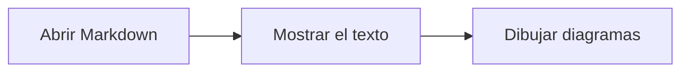

# Renderizado de Mermaid

Markdown Viewer convierte los bloques de código con el lenguaje `mermaid` en diagramas. La biblioteca viene incluida en la app y funciona sin conexión a internet. El texto del documento aparece primero; los diagramas se dibujan después.

## 1. Cómo escribir un diagrama

Usa un bloque cercado con tres comillas invertidas y el lenguaje `mermaid`:

````markdown

````

Ese bloque se muestra así:


El nombre del lenguaje debe ser `mermaid` en minúsculas. Los demás bloques siguen mostrando su código. [`examples/diagramas.md`](../examples/diagramas.md) contiene diagramas de flujo, secuencia y estados para probar la app.

Se incluye Mermaid 11.17.2. La biblioteca completa se carga bajo demanda al encontrar diagramas. No añadimos paquetes externos de diseños, fuentes o iconos; los diagramas que requieren esos recursos adicionales no tienen soporte configurado. La [documentación oficial](https://mermaid.js.org/intro/) explica la sintaxis de Mermaid.

## 2. El recorrido desde el Markdown hasta la imagen

Rust interpreta el bloque con `pulldown-cmark` y lo convierte en `pre` y `code`. El texto está escapado como en cualquier bloque de código. `ammonia` conserva exclusivamente la clase `language-mermaid` entre las clases del documento, para que la interfaz pueda identificarlo.

Después de mostrar el HTML y avisar de que el texto está listo, `app.js` busca los bloques Mermaid. Si no encuentra ninguno, no importa la biblioteca. Si encuentra bloques, importa el módulo local `vendor/mermaid.js` y conserva esa promesa para reutilizarlo en futuras aperturas.

`src/mermaid.js` procesa los bloques de uno en uno y envía el código a un iframe invisible con sandbox. Ese iframe carga `src/mermaid-frame.js` desde la app y tiene un origen opaco, sin permiso `allow-same-origin`. La comunicación se limita a mensajes con el código, el tema, un identificador y el SVG resultante.

Dentro del iframe, el renderizador crea un contenedor temporal con dimensiones medibles. Mermaid necesita ese espacio para calcular el tamaño de las etiquetas y distribuir las figuras. La interfaz comprueba la ventana emisora y el identificador antes de aceptar un resultado.

El SVG generado se convierte en una dirección `data:image/svg+xml;base64,...` y se carga en un elemento `img`. Tras decodificar la imagen, el módulo coloca una figura antes del bloque y oculta el código. Siempre retira el contenedor temporal, incluso si falla el renderizado.

El SVG visible es una imagen. No se inserta como HTML activo dentro del artículo y no se registran los manejadores interactivos que puede devolver Mermaid. Los títulos de accesibilidad del SVG se usan como texto alternativo; si no hay título, se utiliza "Diagrama Mermaid" con su número.

## 3. Cómo sigue el tema y evita resultados atrasados

Los diagramas usan el tema `default` o `dark` según la preferencia del sistema. La interfaz escucha los cambios de `prefers-color-scheme` y solicita otro renderizado cuando cambia esa preferencia.

El código original queda oculto, disponible para reconstruir el diagrama. Una tabla débil, `WeakMap`, asocia cada bloque con su figura o aviso. Al volver a renderizar, el resultado anterior se reemplaza, sin duplicar figuras.

Mermaid tiene una configuración compartida. Por eso los lotes se ejecutan en una cola de promesas, también cuando cambia el tema.

Antes y después de las operaciones asíncronas, el módulo comprueba si la petición sigue siendo la actual y si el bloque todavía pertenece al documento visible. Al abrir otro archivo o pedir otro tema, descarta los resultados antiguos. Esa comprobación no cancela el cálculo que ya está en marcha.

## 4. Cómo se limita el contenido del diagrama

La configuración fija `securityLevel: 'strict'`, desactiva las etiquetas HTML y evita el renderizado automático al cargar la biblioteca. Los diagramas no pueden relajar esas reglas ni cambiar los límites mediante directivas `init` o frontmatter, porque esas opciones se marcan como `secure`.

El cálculo también está aislado. El iframe usa `sandbox="allow-scripts"` para ejecutar la biblioteca, sin acceso al DOM de la interfaz ni al origen de la app. Su CSP propia bloquea conexiones, recursos externos e imágenes remotas. Solo admite scripts y estilos de los recursos locales del visor e imágenes de datos. No recibe comandos Tauri; intercambia mensajes de renderizado.

El tema, las fuentes y la configuración de limpieza también quedan bajo control de la app. Mermaid limpia el SVG mediante su propia integración con DOMPurify antes de devolverlo. La limpieza de `ammonia` ocurre antes, sobre el HTML del Markdown; no se usa para limpiar ese SVG posterior.

La CSP de Tauri permite marcos del propio origen para alojar ese renderer. No añadimos permisos para scripts o estilos remotos ni `unsafe-inline`. Los estilos incorporados al SVG final pertenecen a la imagen, no a una hoja de estilos insertada en el documento visible. La medición temporal usa el CSS local de la app para el texto.

También se declara la feature `custom-protocol` en Cargo, que la CLI de Tauri activa al compilar la distribución. Esto hace que el ejecutable use el modo de producción de Tauri y su política de contenido. La prueba nativa comprueba que un script inline añadido a la ventana principal no se ejecuta.

Estas decisiones desactivan enlaces, callbacks y otras interacciones del diagrama. Los enlaces normales del Markdown siguen abriéndose con las reglas habituales del visor.

## 5. Límites y errores

Un bloque admite hasta 50 000 caracteres de JavaScript, medidos con `String.length`. Mermaid se configura con `maxEdges: 500`; el cumplimiento de ese límite depende del tipo de diagrama. Estos límites reducen el trabajo admitido, pero no son un tiempo máximo de ejecución ni un límite global de todos los diagramas del documento.

Si la sintaxis es inválida, el diagrama supera el límite o la imagen no puede generarse, aparece un aviso junto al código original. El resto del documento sigue visible y los demás diagramas continúan procesándose. Si falla la importación de la biblioteca, también se conserva el código.

Los diagramas se ajustan al ancho de lectura. Son imágenes estáticas, sin zoom propio, selección de etiquetas, animaciones interactivas ni botones de edición. Las etiquetas usan fuentes disponibles en el sistema. No se garantiza el uso de recursos externos referenciados por un diagrama ni de sintaxis posterior a la versión incluida.

El renderizado y la distribución ocurren en el WebView, no en un worker. Un documento con muchos diagramas o diagramas complejos puede ocupar la interfaz mientras se calcula. Se mantiene la prioridad de mostrar primero el texto, pero eso no hace gratuito el cálculo posterior.

## 6. Cómo se incluye en la aplicación

[`scripts/build-frontend.mjs`](../scripts/build-frontend.mjs) copia HTML, CSS y JavaScript a `dist/` y empaqueta las entradas Mermaid con esbuild. El coordinador es un módulo ES. El renderer es un script clásico con la biblioteca completa, que puede cargarse desde el origen opaco del sandbox sin abrir CORS para los recursos de Tauri.

Los módulos se guardan en `dist/vendor/`. El coordinador `mermaid.js` y el renderer aislado `mermaid-frame.js` son entradas separadas; la biblioteca se importa dentro del renderer. El build conserva los avisos legales y copia la licencia de Mermaid. Tauri ejecuta este paso antes de `dev` y `build`, y utiliza `dist/` como `frontendDist`.

`dist/` está excluida de Git y se reconstruye con las versiones fijadas en `package-lock.json`. Mermaid y esbuild figuran como dependencias de desarrollo porque se usan para generar los recursos; el código empaquetado de Mermaid sí forma parte de la app distribuida.

No se usa una CDN ni se necesita un servidor de desarrollo. Tras modificar la interfaz, vuelve a generar los recursos o reinicia `npm run dev`.

`npm run check` y `npm test` también ejecutan el build de la interfaz antes de invocar Cargo, mediante `precheck` y `pretest`. El contexto de Tauri necesita que `frontendDist` exista durante la compilación de Rust. Estos pasos permiten ejecutar las comprobaciones en una copia limpia sin haber abierto o compilado previamente el visor.

## 7. Cómo se comprueba

La prueba Rust de la marca Mermaid comprueba que la limpieza conserva `language-mermaid`, mantiene escapado el contenido y elimina clases de otros lenguajes.

La prueba nativa en [`scripts/smoke.py`](../scripts/smoke.py) comprueba la carga bajo demanda, diagramas de flujo, secuencia y estados, imágenes decodificadas, un segundo renderizado oscuro, errores, bloques demasiado grandes, directivas inseguras y cambios de documento durante el renderizado. También abre los documentos de arquitectura y comprueba que sus diagramas se generan sin avisos.

Los comandos y requisitos están en [Validación](../README.md#validación). La prueba de interfaz se ejecuta en Linux. Las compilaciones de Windows y macOS no sustituyen la comprobación visual en esos sistemas.

La medición de apertura termina cuando está listo el texto, antes de cargar Mermaid. Para medir la experiencia con diagramas hay que observar también cuándo terminan las imágenes; el benchmark actual no informa ese segundo tiempo.
