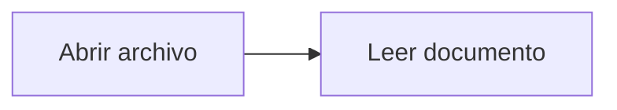
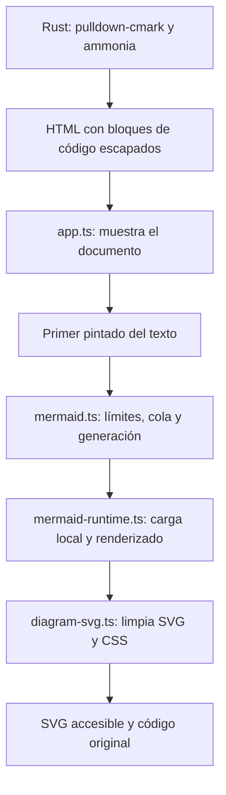

# Diagramas Mermaid

Markdown Viewer dibuja los bloques de código con lenguaje `mermaid` después de
mostrar el texto del documento. La biblioteca está incluida en el paquete de la
app; no se usa una CDN ni un servicio de renderizado remoto.

## Uso

Escribe un bloque cercado con el lenguaje en minúsculas:

````md

````

El diagrama sigue el tema claro u oscuro del sistema. El desplegable "Ver código"
conserva la definición original. Si hay un error de sintaxis, un límite excedido
o una función no admitida, aparece un aviso junto al bloque y su código queda
visible. Los demás diagramas y el resto del documento siguen disponibles.

[`examples/mermaid.md`](../examples/mermaid.md) reúne los tipos admitidos y ejemplos
de error. Los diagramas de la documentación del proyecto también sirven como
ejemplos de flujos y secuencias.

## Formatos y límites

| Formato | Cabecera |
| --- | --- |
| Flujo | `flowchart` o `graph` |
| Secuencia | `sequenceDiagram` |
| Estados | `stateDiagram-v2` o `stateDiagram` |
| Clases | `classDiagram` |
| Relaciones entre entidades | `erDiagram` |

La primera entrega limita el renderizado automático a 50 bloques por documento.
Cada fuente puede tener hasta 50.000 unidades UTF-16. Mermaid tiene además un
límite de 500 aristas para los grafos. Los bloques restantes conservan el código
y explican el límite.

La app controla la configuración de Mermaid. No se admiten frontmatter,
directivas `%%{...}%%`, instrucciones `style`, `classDef` o `linkStyle`, ni formas
con metadatos `@{...}` que puedan incorporar recursos. Esta detección es
conservadora y puede rechazar texto de etiquetas que coincida con esas
instrucciones. Las acciones de clic están desactivadas.

Estos límites reducen el trabajo de renderizado, pero no garantizan un tiempo
máximo. El cálculo de un diagrama puede ocupar el hilo del WebView; un temporizador
no puede cancelarlo mientras ejecuta trabajo síncrono.

## Arquitectura



El contrato IPC mantiene los mismos campos de `Document`: `path`, `name`, `html`
y `bytes`. Rust no ejecuta Mermaid ni permite SVG crudo en el HTML del documento.
`ammonia` permite únicamente `language-mermaid` en los elementos `code`.
Las pruebas de `document.rs` verifican que esa clase y el código escapado se
conservan, y que las demás clases y los atributos activos se eliminan.

[`src/mermaid.ts`](../src/mermaid.ts) prepara las figuras, identifica los tipos,
aplica límites y carga el renderizador solo si hay un bloque válido. Usa una sola
promesa de importación. Si la carga falla, la descarta para permitir un reintento
en una apertura posterior.

El controlador serializa los diagramas y cede el turno al navegador entre
bloques. Una generación identifica el documento visible y el tema. Antes y
después de cada espera comprueba esa generación y que el bloque siga conectado.
Si se abre otro documento o cambia el tema, los resultados anteriores no se
insertan. Las peticiones de apertura tienen un contador diferente: cancelar el
selector o fallar al abrir un archivo conserva el renderizado del documento que
sigue visible.

[`src/mermaid-runtime.ts`](../src/mermaid-runtime.ts) configura Mermaid en modo
`strict`, desactiva etiquetas HTML y las acciones de clic, y activa
`suppressErrorRendering`. Crea un contenedor fuera de la pantalla para que el
motor pueda medir las etiquetas. Un bloque `finally` lo elimina al terminar,
incluidos los errores. No usa `display:none`, porque impediría medir el contenido.

## SVG, CSS y CSP

Mermaid genera SVG después de la limpieza con `ammonia`, por lo que necesita una
segunda ruta de limpieza. [`src/diagram-svg.ts`](../src/diagram-svg.ts) usa
DOMPurify para eliminar scripts, eventos, contenido HTML incrustado, imágenes y
animaciones. Elimina enlaces, limita las referencias a identificadores locales
y asigna identificadores propios a cada SVG para evitar colisiones entre
diagramas. Conserva sus etiquetas accesibles o añade un título genérico.

css-tree interpreta los estilos y permite solo propiedades pasivas de dibujo y
tipografía. Rechaza reglas `@`, valores sin analizar, URLs externas y selectores
que puedan alcanzar elementos fuera del SVG. Los atributos `style` del resultado
se eliminan y sus propiedades de presentación admitidas pasan a atributos SVG.

La CSP de Tauri conserva `script-src 'self'`, `style-src 'self'`, `frame-src 'none'`
y `object-src 'none'`. Tauri incorpora un nonce al elemento de confianza
`#mermaid-style-nonce` del HTML de la app. Solo los estilos filtrados reciben ese
nonce. El documento Markdown no obtiene autorización para incluir estilos
arbitrarios.

Mermaid 11 no ofrece una API para añadir el nonce al estilo que usa durante el
renderizado temporal. [`scripts/mermaid-build.mjs`](../scripts/mermaid-build.mjs)
adapta los puntos de inserción y serialización durante el empaquetado.
`protectMermaidStyle` filtra el CSS y aplica el nonce antes de conectar el estilo.
Las asignaciones de atributos de D3 pasan por `setMermaidAttribute`, que aplica
solo declaraciones admitidas mediante CSSOM. Antes de serializar, la app convierte
los estilos de presentación a atributos SVG y guarda la hoja CSS por separado.
Después de DOMPurify, crea una hoja nueva con el nonce y los identificadores del
SVG final. Así los clones del sanitizador no insertan estilos sin autorización.
El adaptador comprueba los puntos de integración y falla si cambian. No modifica
`node_modules`.

La comprobación antes de insertar estilos protege también el contenedor temporal.
La limpieza del SVG final, por sí sola, llegaría tarde para esa fase. La app
también rechaza instrucciones de fuente que puedan introducir CSS o recursos
durante el renderizado.

## Empaquetado y compatibilidad

`scripts/frontend.mjs` ejecuta TypeScript sin emitir archivos y empaqueta con
esbuild en formato ESM y objetivo ES2020. `app.js` se carga como módulo; Mermaid,
DOMPurify, css-tree y sus dependencias quedan en módulos locales diferidos.
El modo de seguimiento mantiene el mecanismo de Node compatible con Sprite.

Las versiones directas están fijadas en `package.json`; `pnpm-lock.yaml` fija las
dependencias transitivas. La implementación usa Mermaid 11.17.2. Type-fest es una
dependencia de desarrollo requerida por las declaraciones de tipos publicadas
por Mermaid; no se incluye en la app.

La configuración conserva macOS 10.15 como mínimo del paquete. Elegir Mermaid 11
y transpilar a ES2020 evita adoptar directamente los requisitos de Mermaid 12,
pero no certifica todos los navegadores antiguos ni añade APIs ausentes. Las
pruebas Linux validan WebKitGTK disponible en el entorno; Windows y macOS
requieren comprobación en equipos reales, especialmente sus versiones mínimas.

## Validación y medición

`pnpm test:frontend` empaqueta las mismas fuentes en IIFE para jsdom. Sustituye solo
el renderizador asíncrono en las pruebas de apertura y coordinación. Las pruebas
de limpieza ejecutan DOMPurify y css-tree reales. Cubren importación diferida,
varios bloques, errores aislados, resultados tardíos, cambios de tema,
reintentos, límites, limpieza de CSS y referencias locales.

`scripts/smoke.py` prueba el paquete ESM de producción dentro de Tauri en Linux,
con el nonce y la CSP reales. Abre el ejemplo, comprueba SVG de los cinco tipos,
errores de sintaxis/configuración y los diagramas de la documentación. También
comprueba que el contenedor temporal desaparece y que no se conserva contenido
activo en los SVG finales.

La validación en Linux pasó con WebKitGTK 2.52.6: los cinco tipos del ejemplo,
los 13 diagramas de la documentación y ninguna infracción de CSP. También pasaron
35 pruebas de frontend, 10 de Rust y 6 del contrato IPC, además de `pnpm check`.
En Sprite, el paso del selector de archivos encontró un fallo del sandbox del
cargador de iconos GTK. Para completar ese paso se usó un adaptador temporal que
selecciona el [modo de pruebas de Glycin](https://gnome.pages.gitlab.gnome.org/glycin/libglycin/enum.SandboxSelector.html).
La comprobación de Mermaid en Tauri pasó también sin ese adaptador. La app
distribuida conserva la configuración normal del cargador de iconos.

La medición `content_painted` sigue indicando la oportunidad de primer pintado
del texto. `data-diagrams-ready-ms` mide por separado la duración del lote de
diagramas desde que empieza la cola, incluida la importación inicial. No mide el
pintado físico del compositor.

Para validar los cambios:

```sh
pnpm check
pnpm test
pnpm build:binary
xvfb-run -a dbus-run-session -- python3 scripts/smoke.py
```

Los requisitos de la prueba nativa están en el [README](../README.md#validación).
Antes de actualizar Mermaid, hay que repetir las pruebas de estilos y CSP,
revisar el adaptador y comprobar los WebViews de los sistemas admitidos.
