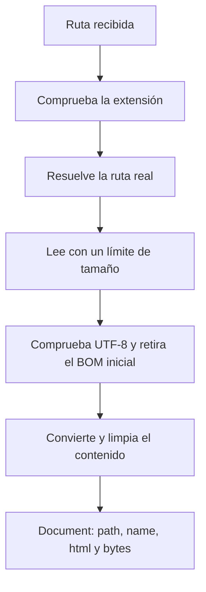
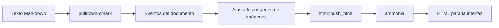
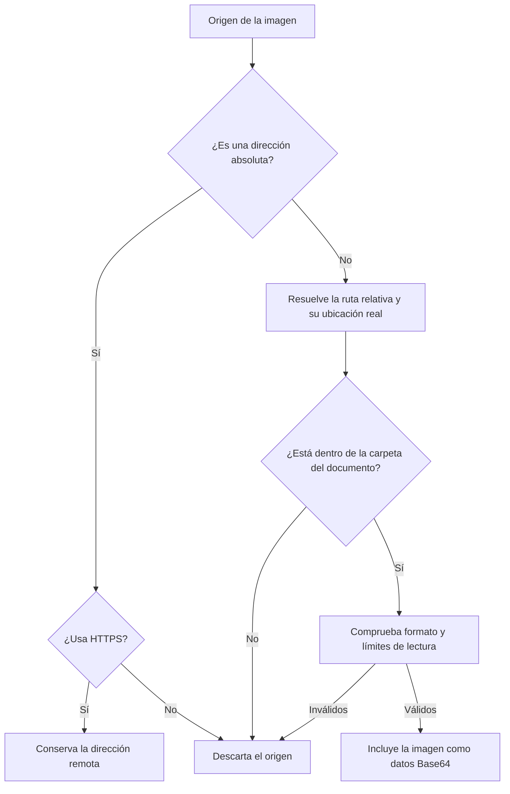

# El procesamiento del documento

Esta pieza recibe la ruta de un Markdown y devuelve su contenido como HTML, junto con el nombre, la ruta y el tamaño del archivo. También valida lo que lee y limpia el HTML antes de que llegue a la interfaz.

Es la tercera pieza de [la arquitectura](arquitectura.md) y está en [`src-tauri/src/document.rs`](../src-tauri/src/document.rs). Los diagramas usan Mermaid. GitHub y el visor los renderizan.

## 1. Qué recibe y qué devuelve

La función pública `load` recibe una ruta. La [coordinación en Rust](coordinacion-rust.md) la llama desde una tarea de trabajo y devuelve el resultado a JavaScript.

Si todo funciona, `load` entrega un `Document`:

| Campo | Contenido |
| --- | --- |
| `path` | Ruta completa después de resolver la ubicación real del archivo. |
| `name` | Nombre del archivo, como `lectura.md`. |
| `html` | HTML convertido y limpiado, listo para la interfaz. |
| `bytes` | Tamaño del Markdown original en bytes. No incluye las imágenes ni el tamaño del HTML. |

`Document` usa `Serialize` para que Tauri pueda transportar esos campos a JavaScript. Si algo falla, la función entrega un mensaje de error en lugar de un documento parcial.

Cada paso prepara el siguiente. El renderizador solo recibe texto después de que la lectura y la comprobación de codificación hayan terminado correctamente.

## 2. Cómo lee el archivo

`is_markdown` acepta `.md`, `.markdown`, `.mdown` y `.mkd` sin distinguir mayúsculas. Esta comprobación usa la extensión, no intenta detectar el formato del contenido.

Después, `canonicalize` resuelve la ruta real, incluidos los enlaces simbólicos. La carpeta de esa ruta será la referencia para las imágenes relativas. Si abres un enlace simbólico hacia un Markdown de otra carpeta, las imágenes se buscan junto al archivo de destino.

`read_limited` abre el archivo, comprueba que sea un archivo normal y revisa su tamaño. Lee como máximo el límite más un byte y vuelve a comprobar el resultado. La segunda comprobación también detecta que el archivo haya crecido entre la consulta de tamaño y la lectura.

El límite del Markdown es 16 MiB. Si los bytes no forman texto UTF-8 válido, la carga falla. Si el texto empieza con un BOM, una marca de codificación que algunos programas añaden, se retira antes de convertirlo.

Esta pieza lee el archivo completo dentro del límite. No hay lectura por páginas, vigilancia de cambios ni escritura sobre el original.

## 3. Cómo interpreta el Markdown

`render` crea un parser de `pulldown-cmark`. Un parser interpreta la sintaxis del texto y reconoce elementos como encabezados, párrafos, enlaces o imágenes.

El parser produce eventos a medida que recorre el documento. Por ejemplo, un encabezado produce un evento de inicio, su texto y un evento de cierre. Nuestro código conserva los eventos y modifica los de inicio de imagen para resolver su origen.

`html::push_html` convierte esos eventos en HTML. Por ejemplo, `# Hola` produce `<h1>Hola</h1>`. Después, la limpieza decide qué etiquetas, atributos y direcciones pueden conservarse.

Activamos explícitamente tablas, texto tachado, listas de tareas y notas al pie. La base del parser es CommonMark, pero no hemos pasado toda su suite de conformidad contra el visor. La limpieza y las restricciones de recursos también pueden cambiar el resultado visible.

Rust conserva Mermaid como código escapado con la clase `language-mermaid`. La interfaz lo convierte después en un diagrama SVG y limpia ese resultado por separado. Las fórmulas no tienen un renderizador y los lenguajes de los bloques no reciben colores de sintaxis.

## 4. Cómo encuentra las imágenes

Para una imagen Markdown como ``, `image_source` recibe el origen y la carpeta del documento.

Las rutas locales absolutas se rechazan. Para una ruta relativa, Rust la resuelve como una dirección de archivo, lo que permite interpretar espacios y caracteres Unicode codificados en el enlace. Después comprueba la ubicación real para detectar escapes mediante `../` o enlaces simbólicos.

Si el Markdown real está en `/notas/lectura.md`, estos son algunos resultados:

| Origen | Resultado |
| --- | --- |
| `imagenes/portada.png` | Se admite si existe en `/notas/imagenes/` y cumple los límites. |
| `../privado.png` | Se rechaza porque termina fuera de `/notas/`. |
| `imagenes/enlace.png`, un enlace simbólico hacia fuera | Se rechaza por su ubicación real. |
| `https://ejemplo.com/portada.png` | Conserva la dirección; el WebView la carga. |
| `http://ejemplo.com/portada.png` | Se rechaza. |
| `file:///otra/carpeta/portada.png` | Se rechaza. |

Se admiten PNG, JPEG, GIF, WebP, AVIF y SVG. El tipo se elige por la extensión; esta función no decodifica la imagen para comprobar su contenido. El WebView se encarga de mostrarla.

Cada imagen local puede ocupar hasta 8 MiB y el conjunto hasta 32 MiB. El presupuesto cuenta los bytes leídos antes de convertirlos a Base64. Una imagen repetida se procesa en cada aparición y vuelve a consumir presupuesto; actualmente no hay caché de imágenes.

## 5. Por qué incluye imágenes locales en el HTML

Base64 convierte los bytes de una imagen en texto que puede incluirse en una dirección `data:image/...;base64,...`. El WebView recibe la imagen junto al HTML y puede mostrarla sin leer su ruta del disco.

Eso aumenta el tamaño del HTML y el trabajo previo a mostrarlo. Los límites de imágenes se aplican a los bytes originales; la representación Base64 ocupa más espacio.

Las imágenes HTTPS no consumen ese presupuesto local y Rust no las descarga. Por eso el texto puede mostrarse antes de que lleguen las imágenes remotas. Las imágenes locales sí afectan al tiempo de conversión.

Si una imagen no existe o no cumple las reglas, `image_source` devuelve ningún origen y el renderizador sustituye su destino por una cadena vacía. La carga del Markdown continúa; no aparece un error global por esa imagen.

## 6. Qué elimina la limpieza de HTML

`ammonia` usa su lista de etiquetas y atributos permitidos como base. Nuestra configuración añade los atributos de las casillas de tareas, la alineación de celdas y los identificadores `id`. Permite solo la clase `language-mermaid` en `code` para que la interfaz identifique esos bloques; no permite clases arbitrarias del documento.

Los scripts y atributos activos como `onerror` se eliminan. Los esquemas de URL admitidos por la limpieza son `http`, `https`, `mailto` y `data`. Para direcciones relativas, `relative_url` conserva únicamente las que empiezan por `#`.

Estas reglas se complementan con otras piezas. La [interfaz](interfaz.md) revisa que las imágenes tengan HTTPS o datos Base64 de un formato admitido. La coordinación solo abre enlaces web y de correo. La CSP de Tauri limita lo que el WebView puede cargar o ejecutar.

Las imágenes Markdown relativas funcionan porque se convierten en datos antes de la limpieza. Una imagen escrita como HTML crudo, por ejemplo ``, no pasa por ese tratamiento y pierde la dirección relativa. Los enlaces como `[Otro](otro.md)` también pierden su destino relativo; `[Sección](#seccion)` se conserva.

## 7. Cómo leer los errores

| Situación | Comportamiento |
| --- | --- |
| Extensión no admitida | Pide seleccionar un Markdown. |
| Ruta inexistente o imposible de resolver | Indica que no se encontró el archivo. |
| Falta de permisos o fallo al abrir | Pide comprobar la existencia y los permisos. |
| Carpeta en lugar de archivo | Pide seleccionar un archivo. |
| Tamaño superior al límite | Informa de que supera el tamaño admitido. |
| Texto no válido como UTF-8 | Pide un archivo con esa codificación. |
| Imagen inválida o bloqueada | Omite su origen y continúa con el documento. |

El procesador devuelve el error a la coordinación. La interfaz decide cómo mostrarlo y conserva el documento anterior si la nueva carga falla.

## 8. Cómo comprobar o ampliar esta pieza

Las pruebas al final de `document.rs` cubren conversión, limpieza de HTML activo, enlaces internos, rutas Unicode, BOM, tamaños e imágenes fuera de la carpeta permitida. La prueba de escapes por enlaces simbólicos se ejecuta en sistemas Unix.

Para cambiar formatos o límites, empieza por las constantes, `is_markdown` e `image_source`. Para activar otra extensión del parser, revisa las opciones de `render` y comprueba también si la limpieza conserva su HTML.

Una nueva función de visualización puede necesitar cambios en la interfaz. Reconocer su sintaxis no basta para dibujarla. Consulta [Mermaid](mermaid.md) y [La interfaz](interfaz.md) para seguir el recorrido después de la conversión, y el [README](../README.md#validación) para ejecutar las comprobaciones.
