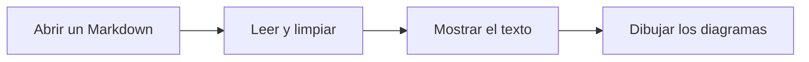
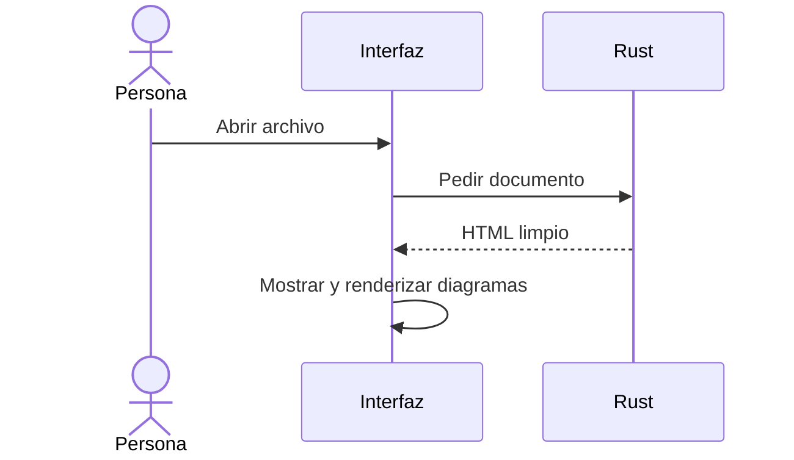
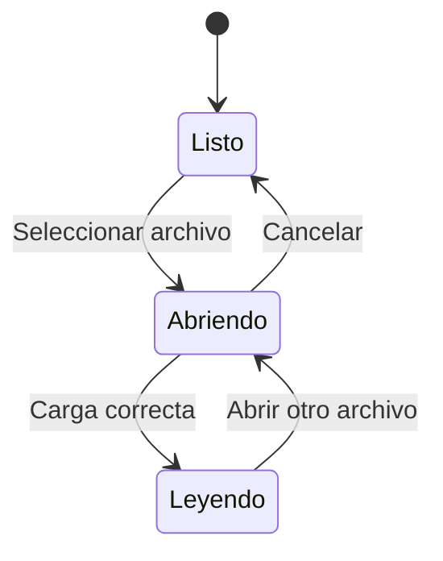

# Diagramas Mermaid

Los diagramas se generan dentro de la app, sin conexión a internet.

## Flujo de lectura

```mermaid
flowchart LR
    A["Abrir un Markdown"] --> B["Leer y limpiar"]
    B --> C["Mostrar el texto"]
    C --> D["Dibujar los diagramas"]
```

## Petición a Rust

```mermaid
sequenceDiagram
    actor Persona
    participant Vista as Interfaz
    participant Rust
    Persona->>Vista: Abrir archivo
    Vista->>Rust: Pedir documento
    Rust-->>Vista: HTML limpio
    Vista->>Vista: Mostrar y renderizar diagramas
```

## Estados del lector

```mermaid
stateDiagram-v2
    [*] --> Listo
    Listo --> Abriendo: Seleccionar archivo
    Abriendo --> Leyendo: Carga correcta
    Abriendo --> Listo: Cancelar
    Leyendo --> Abriendo: Abrir otro archivo
```
