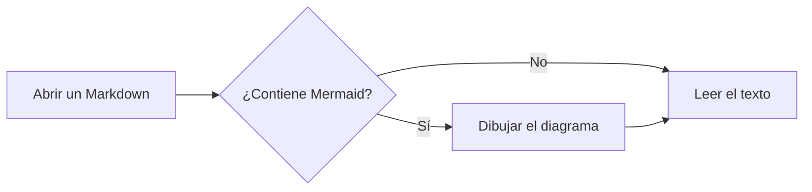
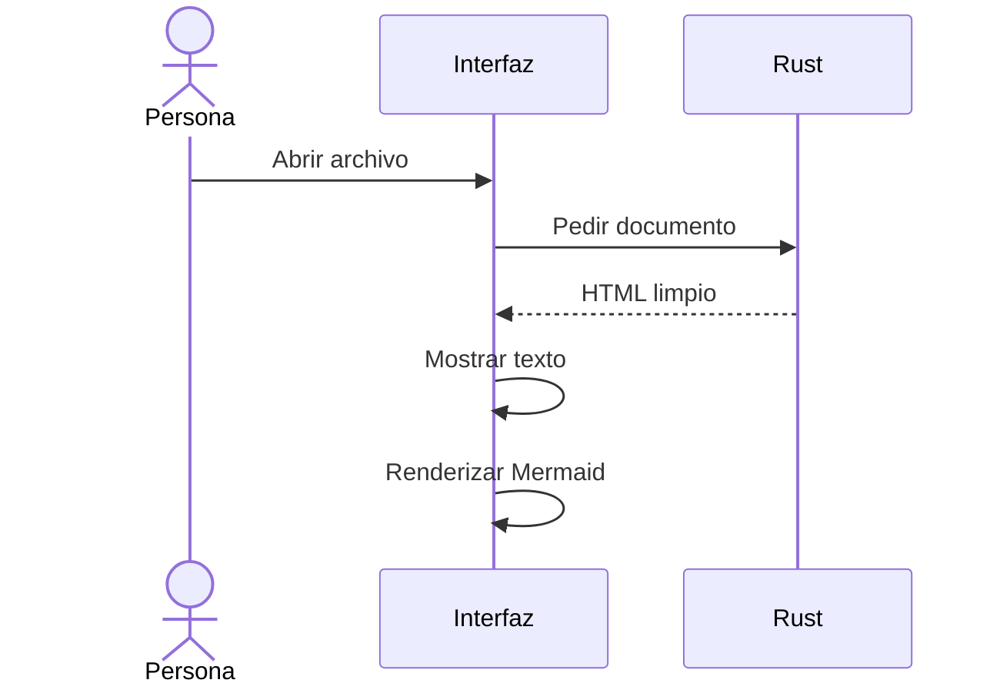
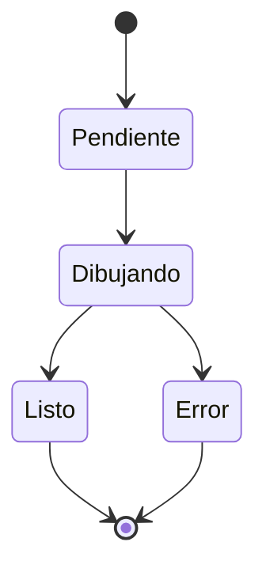
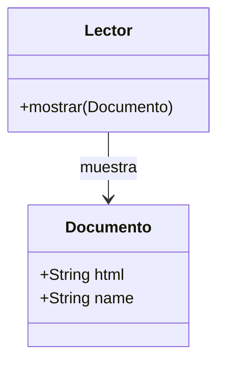
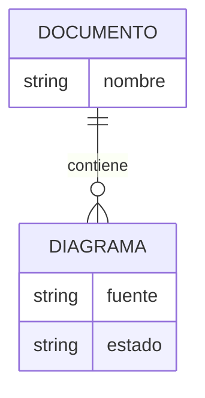
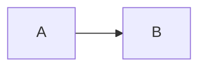

# Diagramas en el lector

Los bloques con lenguaje `mermaid` se convierten en diagramas después de mostrar
el texto. Cada diagrama conserva su definición en **Ver código**.

## Flujo



## Secuencia



## Estados



## Clases



## Relaciones entre entidades



## Error de sintaxis

Este bloque conserva el código y muestra un aviso. Los diagramas anteriores
siguen disponibles.

```mermaid
flowchart LR
    A[Un nodo sin cierre
```

## Configuración no admitida

La aplicación controla el tema y las reglas de seguridad. Las directivas por
bloque no pueden cambiarlas.



## Texto después de los diagramas

Un error de Mermaid no impide seguir leyendo ni abrir otro archivo.
